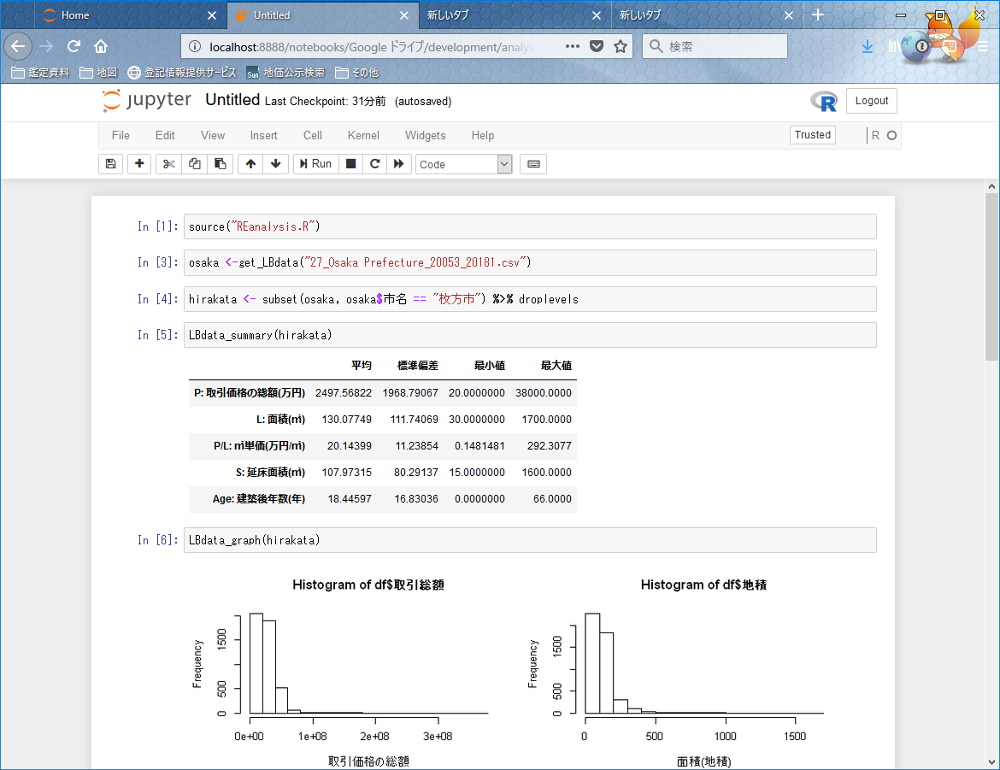

# REanalysis.Rの基本的な使い方
国土交通省で発表している「不動産取引価格情報」のCSVデータを活用し、その統計量やデータの可視化を支援するためのＲ言語モジュールです。

#### ※文字コード等についての注意
REanalysis.Rファイルは、文字コードが「cp932」、改行コードは「CRLF」にしてあります。
Windowsユーザーの場合、このファイルをJupyterNotebook等にそのままsource()関数で読み込んで使えます。

## 不動産取引価格情報データの準備
国土交通省が公開する[土地総合情報システム](http://www.land.mlit.go.jp/webland/)内の[不動産取引価格情報ダウンロード](http://www.land.mlit.go.jp/webland/download.html)のページからCSV形式のデータがダウンロード出来ます。
CSVデータは、四半期単位での期間設定を行い、各都道府県ごと、市町村ごとを選択してダウンロードできます。

ここでは、以下の条件でCSVデータをダウンロードしてみます。
|項目|選択内容|
|---|---|
|取引時期From|平成17年第3四半期|
|取引時期To|平成30年第１四半期|
|都道府県|大阪府|
|市区町村|全市区町村|

ダウンロードボタンを押すと、**27_Osaka Prefecture_20053_20181.zip**というファイルがダウンロードされます。zipファイルを展開すると**27_Osaka Prefecture_20053_20181.csv**という名前のcsvファイルが入手できます。

## 環境の準備
RstudioやJupyterNotebook等のR言語を実行できる環境を用意します。

また、REanalysis.Rでは、内部で次のパッケージを呼び出しているので、環境に次のパッケージが無い場合は事前にインストールしておく必要があります。
- stringr
- data.table
- ggplot2


## REanalysis.Rモジュールの読み込み
source関数を使って、スクリプトを読み込みます。

```
source("REanalysis.R")
```

## 建物及びその敷地データの読み込み
当該CSVデータには、様々な種別、類型のデータが混在しています。
そこで、これら混在データの中から建物及びその敷地として取引されたデータを簡単に取り出せる関数として**get_LBdata**関数があります。

```
osaka <- get_LBdata("27_Osaka Prefecture_20053_20181.csv")
```

戻り値は、R言語の基本的な型である、dataFrame型で戻ります。

データを様々な条件で選別します。
```
hirakata <- subset(osaka, osaka$市名 == "枚方市") %>% droplevels
```


## データの可視化
CSVから読み込まれたデータの統計量を簡単に見ることが出来ます。
まずは、平均、標準偏差、最小値、最大値を表示します。
```
LBdata_summary(hirakata)
```
JupyterNotebook環境のスクリーンショットを下に示します。


次は、ヒストグラムや分布図の表示です。
```
LBdata_graph(hirakata)
```
グラフは次のように画像ファイルとして取り出すことも出来ます。


## 取引指数の計算とグラフの表示
国土交通省が策定している「不動産価格指数（住宅）」の作成方法を参考に価格指数を算出する関数です。
採用する説明変数などの詳細はモジュールソースを参照してください。

また、現在の所、データ数が多い(都道府県単位レベル)と処理に時間が掛かるため、市町村単位でお使いください。
```
hirakata_index <- make_transaction_index(hirakata,4)
draw_transaction_index_graph(hirakata_index)
```


